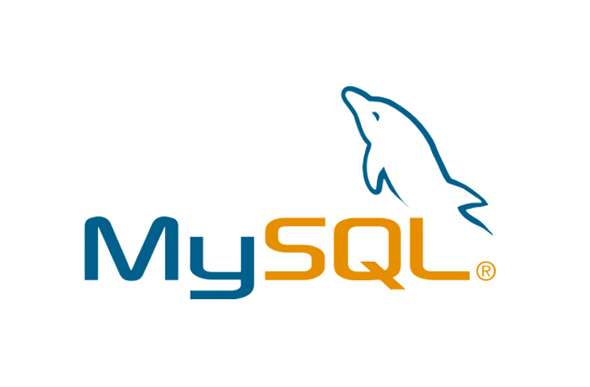

#  Hi! I'm Monlibo 👋 

I create quality websites and web applications with beautiful and simple interfaces.

See my portfolio : https://libert.vercel.app 

## 🤓 About me

- 🚀 I am a web developer <strong> full-stack</strong>.
- 🔭 I am currently learning `Next.js` et `Node Js`.

- I come from Benin 🇧🇯🇧🇯 and I have always been passionate about digital.

- 🐱‍🏍I love the Internet and I like to learn a little more every day.
- 🐱‍💻You can contact me for collaborations.

## 👽 Skills

- ### 🦾 Languages

<table align="center" style="border-collapse: collapse;">
      <tbody>
        <tr>
          <td align="center">
            
            HTML
          </td>
<td  align="center">            
                         
            CSS
          </td>
<td align="center">
                          
            PHP
          </td>

<td align="center">
                         
JavaScript
</td>

<td align="center">
              
     
SQL
</td>
 <td align="center">
              
       Java
 </td>
</tr>
</tbody>
</table>

- ### 🤖 Frameworks

<table  cellspacing="0" align="center" cellpadding="0">
<tbody>
<tr>
<td align="center" >
              
      
TailwindCss
</td>
<td align="center" >
              
           
Laravel
</td>
<td align="center" >
              
      
React.js
</td>

<td align="center" >
              
      
Spring Boot</td>

</tr>
<tr>
<td align="center" >
              
      
      Next.js
</td>
<td align="center">
              
      
Express.js
</td>

<td align="center" >
              
      
Alpine.js</td>

</tr>
</tbody>
</table>

- ### 🛠 Tools and others

<table  cellspacing="0" align="center" cellpadding="0" >
<tbody>
<tr>
<td align="center">
              
      
Livewire
</td>
<td align="center">
              
      
Git</td>
<td align="center">
              
      
Node Js
</td>
<td align="center">
              
      
plantUML</td>
</tr>
<tr>
<td align="center">
              
      
MySQL
</td>
<td align="center">
              
      
RapidAPI</td>
<td align="center">
              
      
Vscode</td>
<td align="center">
              
      
PhotoShop</td>
</tr>
<tr>

<td align="center">
              
      
Access Database
</td>

</tr>
</tbody>
</table>

##  🤹 Projects

<table  cellspacing="0" align="center" cellpadding="0" >
<tbody>
<tr>
<td>
<a href="https://libmusic.vercel.app" >Music App </a> with ReactJs
</td>
<td><a href="https://libert-project.vercel.app/meteo" >Weather App</a> with ReactJs</td>

</tr>
<tr>
<td>

            

</td>
<td>

            
</td>

</tr>
<tr>
<td align="center" colspan="2">See more on my <a href="https://libert.vercel.app">Portfolio</a></td>
</tr>

</tbody>
</table>

##  👨‍⚖️ Services

<table  cellspacing="0" align="center" cellpadding="0" >
<tbody>
<tr>
<td>

Web development

            
</td>
<td>

Designing

           
</td>
<td>

Design

            
</td>
<tbody>
</table>

## 🔮 Contact

- 📪 Mail : libertliboo@gmail.com
- 📱 Phone / Whatsapp : [+229 65 32 35 75](https://wa.me/22965323575)
- 🐦 Twitter : [Libert Assogba](https://twitter.com/libertassogba)

Thank you for reading 
